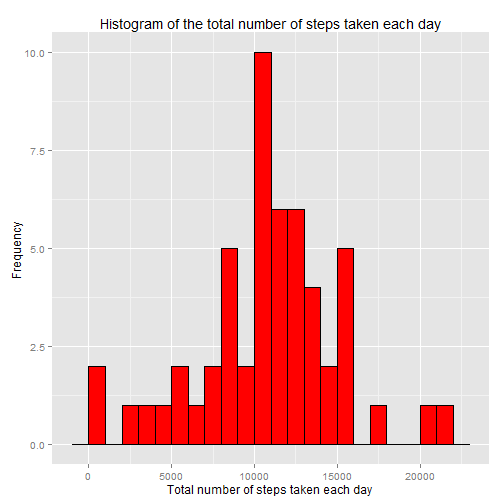
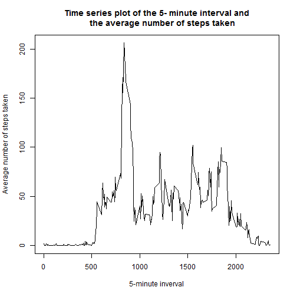
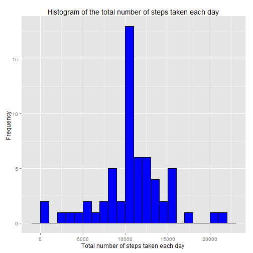
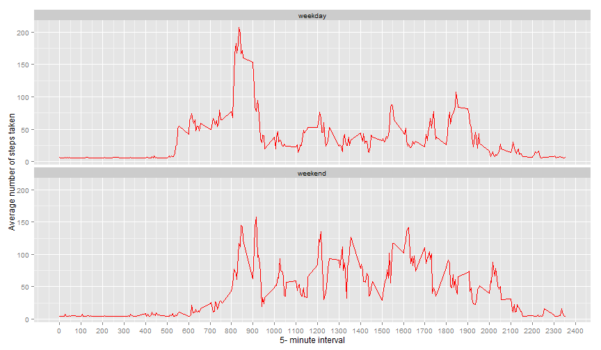

# Reproducible Research Project Assignment 1

  Author: Foo Hooi Ping
  
  Date: Saturday, September 12, 2015
  
  Output: 
    html_document:
      keep_md: true
      

## Introduction 

This assignment make use of data from a personal activity monitoring device, which collects data at 5 minute intervals through out the day. 

The data is from an anonymous individual and is collected during the months of October and November, 2012.

The data contains the number of steps taken in 5 minute invervals each day over the 2 month period. 

This assignment is completed in a **single R markdown** document that can be processed by knitr and be transformed into a HTML file.
 
The purpose of this report  is to :

  (I)  Document and show all the R code needed to reproduce the results in the report.
  
  (II) To answer the following questions :
  
      1. What is the mean total number of steps taken per day ? 
    
      2. What is the average daily activity pattern ? 
    
      3. Imputting missing values 
    
      4. Are there differences in activity patterns between weekdays and weekends ? 
    


##  Data 

The data for this assignment can be :

1. Downloaded from the course web site:

    https://d396qusza40orc.cloudfront.net/repdata%Fdata%2Factivity.zip
    
    

2. Found in the GitHub repository  for this assignment :

    https://github.com/FooHP/RepData_PeerAssessment1/blob/master/activity.zip
    
  
The variables included in this dataset are:

**steps**: Number of steps taking in a 5-minute interval (missing values are coded as NA)

**date**: The date on which the measurement was taken in YYYY-MM-DD format

**interval**: Identifier for the 5-minute interval in which measurement was taken

The dataset is stored in a comma-separated-value (CSV) file and there are a total of 17,568 observations in this dataset.


##  Loading and preprocessing the data

**Go to the GitHub repository  for this assignment :** 

    https://github.com/FooHP/RepData_PeerAssessment1
  
   This repository contains the dataset, activity.zip
   
   NOTE : As such we do not have to download the data separately.
   
   Navigate to the above Github repository and click the "Fork" button.
   
   You now have a copy of the desired repository on your Github account.
   
   Make a local copy on your computer using the following command :
   
      $ git clone https://github.com/yourUserNameHere/RepData_PeerAssessment1.git
   
   This will clone the repository into your current directory.
   
   
**Unzip the dataset, activity.zip, if the unzipped file does not exist** 

 To run the code below you need to replace Dan with yourUserName


```r
if (!file.exists("C:/Users/Dan/RepData_PeerAssessment1/activity.csv")) {
   unzip("C:/Users/Dan/RepData_PeerAssessment1/activity.zip",
   exdir="C:/Users/Dan/RepData_PeerAssessment1")   
}
```

**Load the Data and required packages** 


```r
activity <- read.csv("C:/Users/Dan/RepData_PeerAssessment1/activity.csv",
                     header = TRUE,sep = ",",na.strings = "NA")        
library(dplyr)
```

```
## 
## Attaching package: 'dplyr'
## 
## The following objects are masked from 'package:stats':
## 
##     filter, lag
## 
## The following objects are masked from 'package:base':
## 
##     intersect, setdiff, setequal, union
```

```r
library(ggplot2)
head(activity)
```

```
##   steps       date interval
## 1    NA 2012-10-01        0
## 2    NA 2012-10-01        5
## 3    NA 2012-10-01       10
## 4    NA 2012-10-01       15
## 5    NA 2012-10-01       20
## 6    NA 2012-10-01       25
```

```r
str(activity)
```

```
## 'data.frame':	17568 obs. of  3 variables:
##  $ steps   : int  NA NA NA NA NA NA NA NA NA NA ...
##  $ date    : Factor w/ 61 levels "2012-10-01","2012-10-02",..: 1 1 1 1 1 1 1 1 1 1 ...
##  $ interval: int  0 5 10 15 20 25 30 35 40 45 ...
```
 
**Preprocessing the data** 

    Ignore the missing values in the dataset by filtering it out


```r
act <-filter(activity,!is.na(steps))
head(act)
```

```
##   steps       date interval
## 1     0 2012-10-02        0
## 2     0 2012-10-02        5
## 3     0 2012-10-02       10
## 4     0 2012-10-02       15
## 5     0 2012-10-02       20
## 6     0 2012-10-02       25
```

```r
str(act)
```

```
## 'data.frame':	15264 obs. of  3 variables:
##  $ steps   : int  0 0 0 0 0 0 0 0 0 0 ...
##  $ date    : Factor w/ 61 levels "2012-10-01","2012-10-02",..: 2 2 2 2 2 2 2 2 2 2 ...
##  $ interval: int  0 5 10 15 20 25 30 35 40 45 ...
```


## Answer the following questions :

## 1. What is the mean total number of steps taken per day?


i.   Calculate the total number of steps taken per day


```r
by_date <- group_by(act,date)
a <- summarize(by_date,  Totsteps = sum(steps))
head(a)
```

```
## Source: local data frame [6 x 2]
## 
##         date Totsteps
## 1 2012-10-02      126
## 2 2012-10-03    11352
## 3 2012-10-04    12116
## 4 2012-10-05    13294
## 5 2012-10-06    15420
## 6 2012-10-07    11015
```

```r
tail(a)
```

```
## Source: local data frame [6 x 2]
## 
##         date Totsteps
## 1 2012-11-24    14478
## 2 2012-11-25    11834
## 3 2012-11-26    11162
## 4 2012-11-27    13646
## 5 2012-11-28    10183
## 6 2012-11-29     7047
```


ii.  Make a histogram of the total number of steps taken each day


```r
g1 <- ggplot(a, aes(a$Totsteps)) + geom_histogram(binwidth=1000,fill="red",color="black")
g1 <- g1 + labs(x="Total number of steps taken each day ",y="Frequency ") 
g1 <- g1 + labs(title="Histogram of the total number of steps taken each day")
print(g1)
```

 


iii. Calculate and report the mean and median of the total number of steps taken per day


```r
Avg_tsteps_per_day <- mean(a$Totsteps)
Avg_tsteps_per_day
```

```
## [1] 10766.19
```

```r
Med_tsteps_per_day <- median(a$Totsteps)
Med_tsteps_per_day
```

```
## [1] 10765
```


## 2. What is the average daily activity pattern?


```r
by_interval <- group_by(act,interval)
b <- summarize(by_interval,avgsteps=mean(steps))
head(b)
```

```
## Source: local data frame [6 x 2]
## 
##   interval  avgsteps
## 1        0 1.7169811
## 2        5 0.3396226
## 3       10 0.1320755
## 4       15 0.1509434
## 5       20 0.0754717
## 6       25 2.0943396
```

```r
tail(b)
```

```
## Source: local data frame [6 x 2]
## 
##   interval  avgsteps
## 1     2330 2.6037736
## 2     2335 4.6981132
## 3     2340 3.3018868
## 4     2345 0.6415094
## 5     2350 0.2264151
## 6     2355 1.0754717
```


i.   Make a time series plot (i.e. type = "l") of the 5-minute interval (x-axis) and the average number of steps taken, averaged across all days (y-axis)


```r
plot(b$interval,b$avgsteps,type="l",main="Time series plot of the 5- minute interval and
     the average number of steps taken",
     xlab="5-minute inverval",
     ylab="Average number of steps taken")
```

 


ii.  Which 5-minute interval, on average across all the days in the dataset, contains the maximum number of steps?

```r
b[which(b$avgsteps==max(b$avgsteps)),]
```

```
## Source: local data frame [1 x 2]
## 
##   interval avgsteps
## 1      835 206.1698
```

```r
max_interval <- b$interval[which(b$avgsteps==max(b$avgsteps))]
max_interval
```

```
## [1] 835
```
The maximum number of steps occur at **8:35 am**

Note : interval = 835 is equivalent to 8:35 am 

## 3. Imputing missing values

  i.  Calculate and report the total number of missing values in the dataset 
   (i.e. the total number of rows with NAs)


```r
no_of_NAs <- sum(is.na(activity$steps))
no_of_NAs
```

```
## [1] 2304
```

  ii. Devise a strategy for filling in all of the missing values in the dataset. The       strategy does not need to be sophisticated. For example, you could use the mean/median for that day, or the mean for that 5-minute interval, etc.
  
  
**The strategy I use for filling in all of the missing values in the dataset is to 
use the overall mean number of steps taken per 5-minute interval.
This is computed using  mean total number of steps taken per day divide by 
288 (i.e the total number of 5 minute intervals in a day)**

  iii. Create a new dataset that is equal to the original dataset but with the missing data filled in.

```r
c <- which(is.na(activity$steps))         
actnew <- activity
actnew[c,1] <- Avg_tsteps_per_day/288    
```


   iv.  Make a histogram of the total number of steps taken each day 
   

```r
by_date1 <- group_by(actnew,date)
anew <- summarize(by_date1,  Totsteps = sum(steps))
head(anew)
```

```
## Source: local data frame [6 x 2]
## 
##         date Totsteps
## 1 2012-10-01 10766.19
## 2 2012-10-02   126.00
## 3 2012-10-03 11352.00
## 4 2012-10-04 12116.00
## 5 2012-10-05 13294.00
## 6 2012-10-06 15420.00
```

```r
g2 <- ggplot(anew, aes(anew$Totsteps)) + geom_histogram(binwidth=1000,fill="blue",color="black")
g2 <- g2 + labs(x="Total number of steps taken each day ",y="Frequency ") 
g2 <- g2 + labs(title="Histogram of the total number of steps taken each day")
g2
```

 
   
   
        Calculate and report the mean and median total number of steps taken per day. 
        
   

```r
mean_dailysteps <- mean(anew$Totsteps)
mean_dailysteps
```

```
## [1] 10766.19
```

```r
Med_dailysteps <- median(anew$Totsteps)
Med_dailysteps
```

```
## [1] 10766.19
```
   
Do these values differ from the estimates from the first part of the assignment? 
What is the impact of inputing missing data on the estimates of the total daily         number of steps?

When the overall mean number of steps taken per 5-minute interval is used to fill up the missing NAs :

  The mean total number of steps taken per day remains the same at 10766.19

  The median total number of steps taken per day has increased slightly from 

  10765 to 10766.19 (i.e the median is now the same as the mean total number of 

  steps taken per day) as more values are closer or equal to the mean 


## 4. Are there differences in activity patterns between weekdays and weekends?

    i. Create a new factor variable in the dataset with two levels - "weekday" and
    
    "weekend" indicating whether a given date is a weekday or weekend day.
    

```r
actnew <- mutate(actnew,day=weekdays(as.Date(date)))
wkend <- c("Saturday", "Sunday")
actnew$daytype <- factor(actnew$day %in% wkend, 
                   levels=c(FALSE, TRUE), labels=c("weekday","weekend"))
head(actnew)
```

```
##     steps       date interval    day daytype
## 1 37.3826 2012-10-01        0 Monday weekday
## 2 37.3826 2012-10-01        5 Monday weekday
## 3 37.3826 2012-10-01       10 Monday weekday
## 4 37.3826 2012-10-01       15 Monday weekday
## 5 37.3826 2012-10-01       20 Monday weekday
## 6 37.3826 2012-10-01       25 Monday weekday
```
     

Make a panel plot containing a time series plot (i.e. type = "l") of the 5-minute interval (x-axis) and the average number of steps taken, averaged across all weekday days or weekend days (y-axis). 

```r
by_interval_daytype <- group_by(actnew,interval,daytype)
bnew <- summarize(by_interval_daytype,avgsteps=mean(steps))
g3 <- ggplot(bnew,aes(x=interval,y=avgsteps))
g3 <- g3 + geom_line(linetype=1,color="red") + facet_wrap(~daytype,nrow=2,ncol=1)
g3 <- g3 + scale_x_continuous(breaks = seq(0, 2400, 100))
g3 <- g3 + labs(x="5- minute interval",y="Average number of steps taken")
print(g3)
```

 

Below are my further analysis of the weekday and weekend data 
 

```r
wd <- filter(bnew,daytype=="weekday")
summary(wd)
```

```
##     interval         daytype       avgsteps      
##  Min.   :   0.0   weekday:288   Min.   :  4.984  
##  1st Qu.: 588.8   weekend:  0   1st Qu.:  6.907  
##  Median :1177.5                 Median : 25.762  
##  Mean   :1177.5                 Mean   : 35.611  
##  3rd Qu.:1766.2                 3rd Qu.: 49.940  
##  Max.   :2355.0                 Max.   :207.873
```

```r
sum(wd$avgsteps)
```

```
## [1] 10255.85
```

```r
wd[which(wd$avgsteps==max(wd$avgsteps)),]
```

```
## Source: local data frame [1 x 3]
## Groups: interval
## 
##   interval daytype avgsteps
## 1      835 weekday 207.8732
```

```r
activewd <- filter(wd,avgsteps>50)
head(activewd)
```

```
## Source: local data frame [6 x 3]
## Groups: interval
## 
##   interval daytype avgsteps
## 1      550 weekday 50.07324
## 2      555 weekday 55.31768
## 3      605 weekday 63.00657
## 4      610 weekday 67.89546
## 5      615 weekday 73.67324
## 6      620 weekday 62.25101
```

```r
we <- filter(bnew,daytype=="weekend")
summary(we)
```

```
##     interval         daytype       avgsteps      
##  Min.   :   0.0   weekday:  0   Min.   :  4.673  
##  1st Qu.: 588.8   weekend:288   1st Qu.:  5.642  
##  Median :1177.5                 Median : 32.704  
##  Mean   :1177.5                 Mean   : 42.366  
##  3rd Qu.:1766.2                 3rd Qu.: 70.798  
##  Max.   :2355.0                 Max.   :157.798
```

```r
sum(we$avgsteps)
```

```
## [1] 12201.52
```

```r
we[which(we$avgsteps==max(we$avgsteps)),]
```

```
## Source: local data frame [1 x 3]
## Groups: interval
## 
##   interval daytype avgsteps
## 1      915 weekend 157.7978
```

```r
activewe <- filter(we,avgsteps>50)
head(activewe)
```

```
## Source: local data frame [6 x 3]
## Groups: interval
## 
##   interval daytype avgsteps
## 1      805 weekend 53.79782
## 2      810 weekend 76.92282
## 3      815 weekend 73.73532
## 4      820 weekend 71.67282
## 5      825 weekend 61.29782
## 6      830 weekend 99.11032
```

 
Base on the above panel plot and data analysis, I notice there are some differences in the activity patterns between weekdays and weekends :

1.  During weekdays, the person starts to be more active (> 50 steps/5-minute interval)

    from 5:50 am with peak activity of 207.87 steps/5-minute interval at 8:35 am
    
    During weekends, the person starts to be more active(> 50 steps/5-minute interval) at 
    
    a later time, from 8:05 am , with peak of 157.8 steps/5-minute interval at 9:15 am
    
    
2.  The average total activity per day during weekday is 10255.85

    The average total activity per day during weekend is higher at 12201.52
    
    The weekend has a better spread of activity level 


